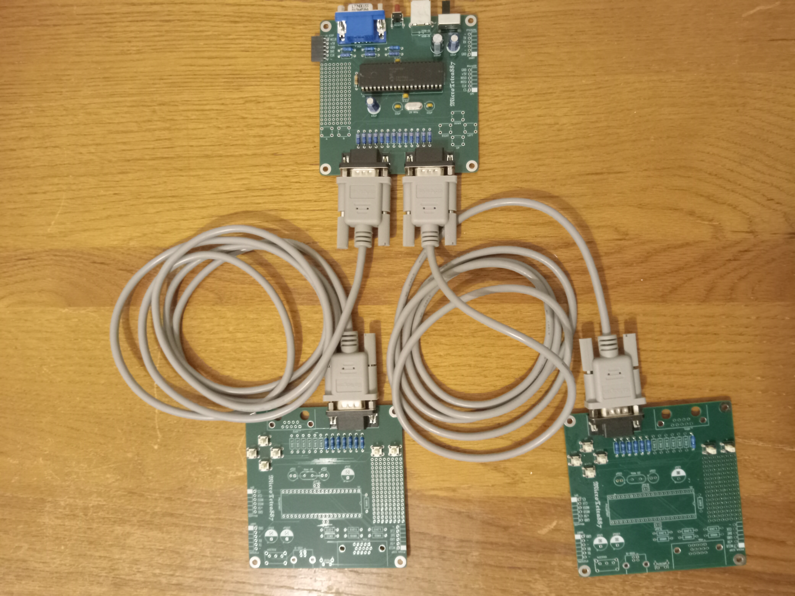
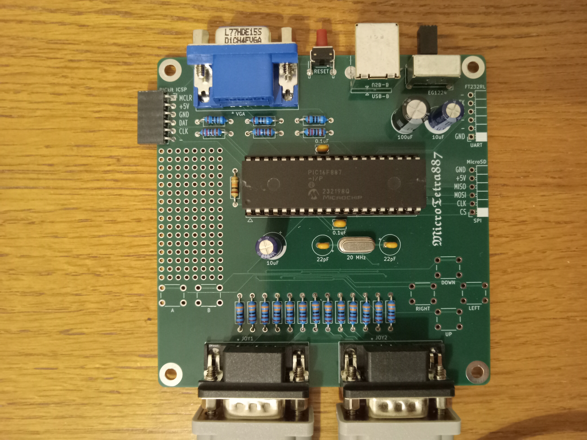
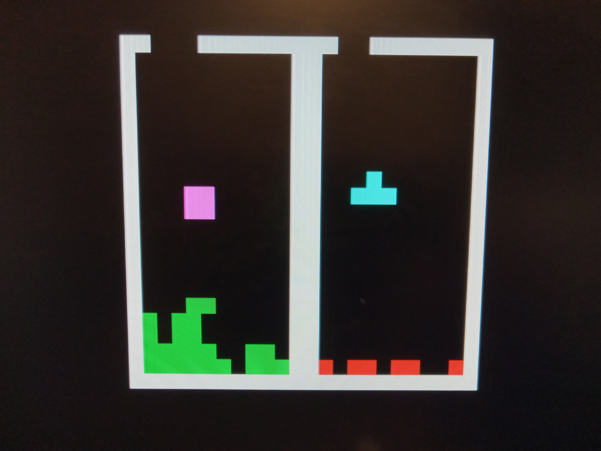
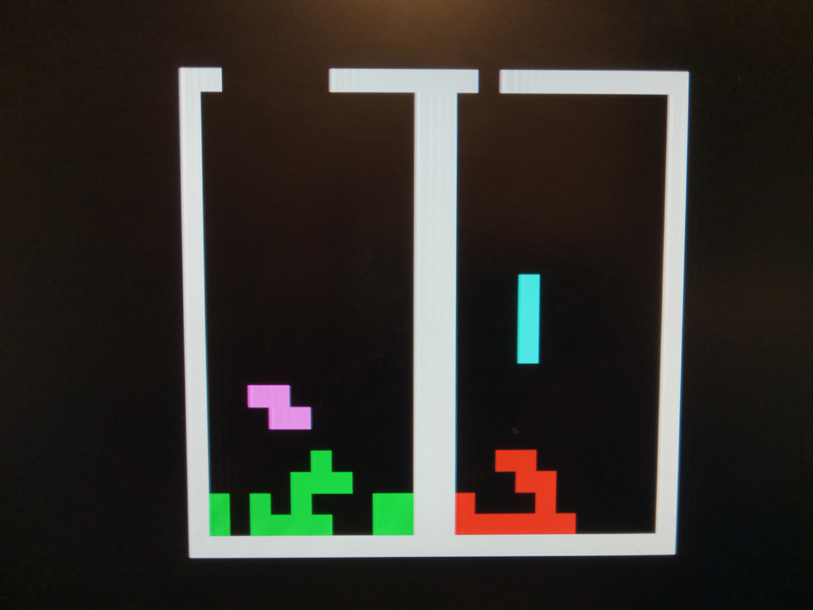
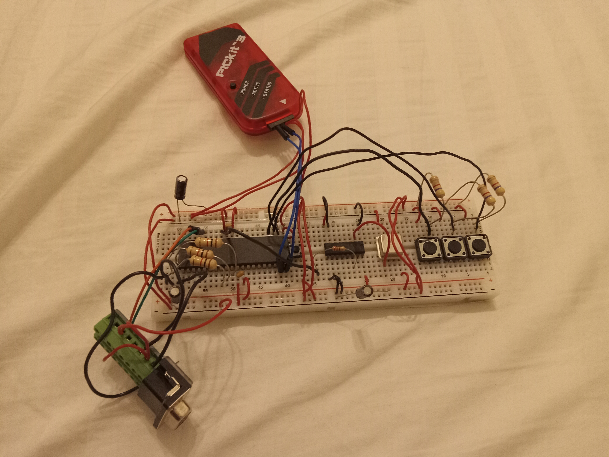
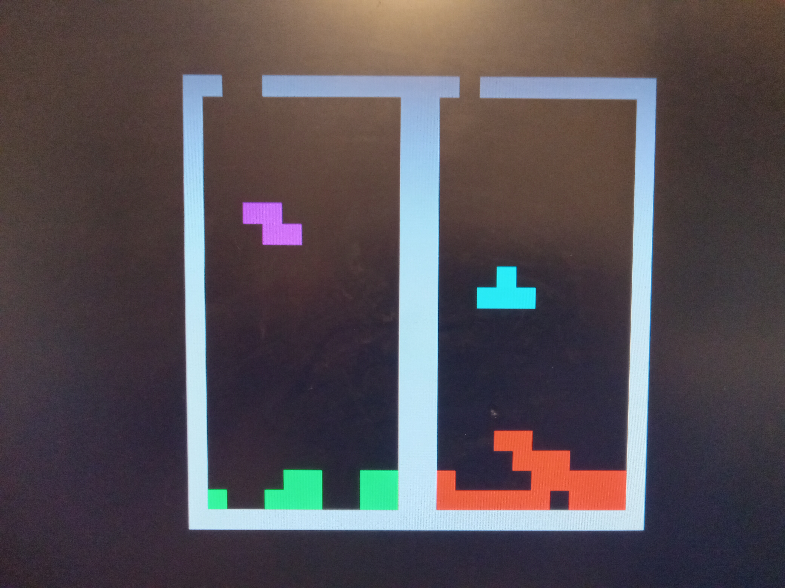

# MicroTetra887
<b>Two-player "Tetra" through 16-color VGA on a PIC16F887</b> 

The goal of this project was a challenge to do more with less.  I have used the PIC24 and PIC32 various times to generate VGA signals and play video games, but the PIC16 has far less capability.  "Tetra" is very easy to implement and one of my favorite games, so it was the target for this device.  Space allowed for there to be two players simultaneously.

Specifications: 
- Only IC is the PIC16F887 
- Runs at 5 MIPS (20 MHz clock) 
- 368 bytes of RAM 
- VGA resolution of 24x22 pixels at 16 colors 
- Two-player "Tetra" through homebrew or Genesis controllers 

This is a work-in-progress.  This project will eventually use a PCB and have updated code.

<table>
  <tr><td></td><td></td></tr>
  <tr><td></td><td></td></tr>
  <tr><td></td><td></td></tr>
</table>

